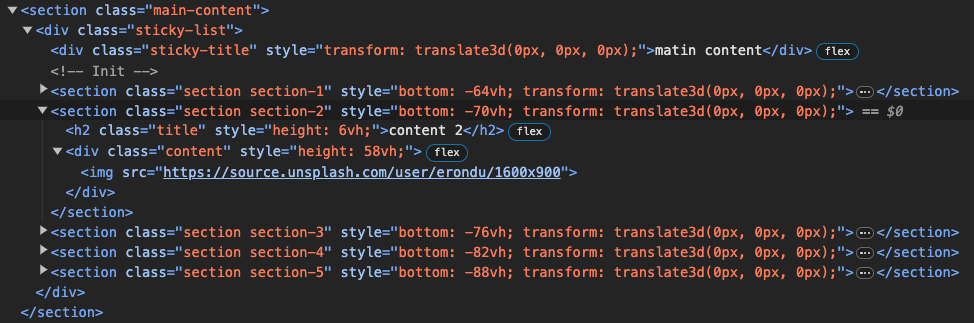

# 🗂️ FolderScroll

 - 🔗 Link : https://hjkimw.github.io/folderScroll/

<br>


추가되는 section 요소들 구조는 다음과 같습니다.


<br>

```javascript

/* 1. 인자로 전달하는 객체의 각 속성에 부합하는 클래스명을 문자열로 넣어줍니다. */
const folderScroll = new FolderScroll({
  wrapper:'.wrapper', // 전체 요소를 감싸는 메인 요소
  stickyWrapper: '.sticky-wrapper', // sticky 시킬 요소들 담는 요소
});

/* 2. 초기화 */
folderScroll.init({
  contentTitle: '.title', // 타이틀
  content: '.content', // 콘텐츠
});

/* 3. 스크롤 이벤트 발생 시 animate() 호출 */
window.addEventListener('scroll', () => folderScroll.animate());

/* 4. 리사이즈 이벤트 발생 시 초기화 */
window.addEventListener('resize', () => {
  folderScroll.init({
    contentTitle: '.title', // 타이틀
    content: '.content', // 콘텐츠
  });
});

```
